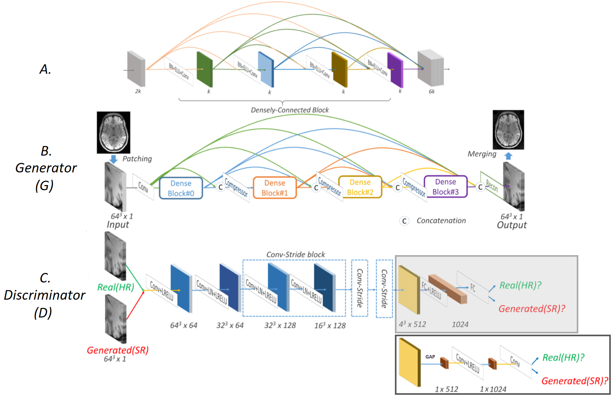

# E6040-super-resolution-project

### Group: SPRL
* 	Huixiang Zhuang hz2538@COLUMBIA.EDU
>https://github.com/hz2538
* 	Hadrien Cornier hc3040@COLUMBIA.EDU
>https://github.com/Hadrien-Cornier

### Getting Started
These instructions will provide you a guideline for our basic functions as well as how to running on your machine for development and testing purposes.

#### Description 
The objective is to create a network that can take a low-resolution MRI scan and turn it into a super resolution scan.

This repo aims at reproducing the results of the paper https://arxiv.org/abs/1803.01417. The network architecture is shown below:

We mainly replaced all fully-connected layers by global average pooling and convolution layers, re-designed the training scheme, and adjusted the extent of low-resolution. 

#### Dataset
The dataset is a large and publicly accessible brain structural MRI database called Human Connectome Project (HCP): https://http://www.humanconnectomeproject.org. The data contains 3D
T1-weighted images from a total of 1,113 subjects that were acquired via a Siemens 3T platform using 32-channel head coils on multiple centers. The images come in high spatial resolution as 0.7 mm isotropic in a matrix size of 256x320x320. You need to register and log in the website: https://db.humanconnectome.org. You can either download full dataset from that website or request access to their Amazon S3.

#### Prerequisites
The coding is based on PyTorch 0.4.0 with CUDA 9.1 and CUDNN 7.5. The project is implemented originally on Google Cloud Platform (GCP).
Basically, you need these tools:

    pip install numpy matplotlib scipy nibabel pandas skimage

See full details of the environment requirements in *requirements.txt*.

#### Introducing the files in project

    |-- csv
        |-- id_hcp.csv
        |-- id_hcp_test.csv
    |-- ecbm6040
        |-- dataloader
            |-- CustomDatasetFromCSV.py
        |-- metric
            |-- eval_metrics.py
        |-- model
            |-- mDCSRN_WGAN.py
        |-- patching
            |-- idx_mine.mat
            |-- patchloader.py
    |-- example_images
    |-- loss_history
    |-- mnt
    |-- models
    |-- README.md
    |-- WGAN_GP.py    
    |-- loaddata.ipynb
    |-- main.ipynb
    |-- requirements.txt
    |-- training_pre.py

        
            
main.ipynb
>This script is our main jupyter notebook. Implemented all experimental results.

loaddata.ipynb
>An example of data loading from google storage, and how we implement dataloaders for batches and patches in this project.

WGAN_GP.py
>contains class WGAN_GP for training, and testing the model.

training_pre.py
>contains function training_pre for Generator pretraining. (This can also be regarded as the complete training of mDCSRN.)

*ecbm6040 backend*

* ecbm6040/dataloader
>contains a custom dataloader than can read medical images (NIFTI files) using the specialized nibabel library and MATLAB matrices (.mat files) using scipy.io.loadmat library.

* ecbm6040/metric
>contains the metrics functions for calculating SSIM, PSNR, and NRMSE.

* ecbm6040/model
>contains mDCSRN_WGAN.py which is the torch file containing the definition of the Generator and Discriminator neural networks.

* ecbm6040/patching
>contains patchloader.py which takes full medical 3D images of dimensions 256x320x320 as input and cuts them into 4x5x5=100 patches of size 64x64x64.

*other folders*

* csv
>contains the id list of the dataset. id_hcp.csv for the complete 1,113 dataset; id_hcp_test.csv for the small 130 dataset.

* example_images
>contains all the example figures for illustration in jupyter notebooks and the intermediate results during training. Considering the space, we only uploaded some of them. All intermediate results during training will be actually stored in this folder.

* loss_history
>contains the loss history through the formal training steps.

* mnt
>a directory that you need to mount the original data folder in google storage to.

* models
>contains the final models.

*other files*

* README.md
>the main introduction of our project.

* requirements.txt
>the required environment for the experiment.

#### How to run the code 

* Make connection to the dataset.
>Multiple options to prepare the dataset:
1. Use the example dataset we prepared. (It's already in folder *mnt*, but the small one that can only used for testing and cannot used for training.)

2. Download from HCP dataset (The link above). But you need to downgrade the HR images by yourself. Here we provide an offline version MATLAB code for you (see kspace.m). Local storage is required. Online version is not provided in consideration of privacy. Then, arrange the data similarly in folder *mnt*.

3. Request for full access to our Google Storage: gs://hz2538
After being accepted, use 

    `gcsfuse --implicit-dirs "hz2538" mnt'
    
to mount the disk to your GCP VM instance or local machine. For 'gcsfuse', see details on their website: https://github.com/GoogleCloudPlatform/gcsfuse

Please contact Huixiang Zhuang: hz2538@columbia.edu.

* Open *main.ipynb* and execute all cells.
